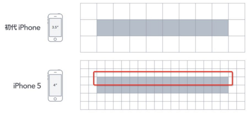
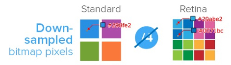

# 移动端布局方案探究
初入移动端，照着淘宝，天猫和网易彩票163的wap主页学习做的demo，主要是排版  
*注意：代码运行是file协议，在chrome里不支持引用本地文件，会提示跨域错误，可以用firefox或者Safari打开*

当时做的ppt下载: [2015年12月移动端布局方案探究](https://github.com/tywei90/mobile_study/raw/master/assets/ppt/mobile_study.ppt)

## 一些基本概念

#### 物理像素(physical pixel)
一个物理像素是显示器(手机屏幕)上最小的物理显示单元

#### 设备独立像素(density-independent pixel)
设备独立像素(也叫密度无关像素)，可以认为是计算机坐标系统中得一个点，这个点代表一个可以由程序使用的虚拟像素(比如: CSS像素)

#### 位图像素
一个位图像素是栅格图像(如：png, jpg, gif等)最小的数据单元。每一个位图像素都包含着一些自身的显示信息(如：显示位置，颜色值，透明度等)

#### 设备像素比(简称dpr)
设备像素比 = 物理像素 / 设备独立像素（在某一方向上，x方向或者y方向）

#### scale
缩放比：scale = 1/dpr

完美视口
```
<meta name="viewport" content="initial-scale=1,width=device-width,user-scalable=0,maximum-scale=1" />

```


## 网易彩票设计方案
[网易彩票](http://caipiao.163.com/t/)
* 采用scale = 1.0写死viewport
* 采用媒体查询来确定html根元素的font-size值，即rem值
* rem + 百分比布局

媒体查询的css代码如下：
```
//网易彩票的响应式布局是采用媒体查询来改变rem值实现的
//媒体查询css
#media-query{
    @media screen and (min-width: 240px) {
        html,body,button,input,select,textarea {
            font-size:9px!important;
        }
    }

    @media screen and (min-width: 320px) {
        html,body,button,input,select,textarea {
            font-size:12px!important;
        }
    }

    @media screen and (min-width: 374px) {
        html,body,button,input,select,textarea {
            font-size:14px!important;
        }
    }

    @media screen and (min-width: 400px) {
        html,body,button,input,select,textarea {
            font-size:15px!important;
        }
    }
    ...
}
```


## 天猫设计方案
[天猫首页](https://www.tmall.com/#/main)
* 采用scale = 1.0写死viewport
* 不采用rem，body的font-size=14px写死
* px + flexbox布局

## 遇到的问题

1. 高清屏下（ dpr>1 ）1px线模糊问题

---

  大多数情况下，设计师产出各种尺寸的稿子，都是先画出大尺寸（一般2x）的稿子，再去缩小尺寸，最后导出。 这样会带来问题：如果设计师在2倍稿子里画了一条1px的线（例如border：1px），这时候假如我们要在scale=1.0里呈现的话，就会变成0.5px，而很大一部分手机是无法画出0.5px的。  
  理论上，1个位图像素对应于1个物理像素，图片才能得到完美清晰的展示。在普通屏幕下是没有问题的，但是在retina屏幕（dpr=2）下就会出现位图像素点不够，从而导致图片模糊的情况。



2. 高清屏下（ dpr>1 ）高清图片模糊问题

    对于dpr=2的retina屏幕而言，1个位图像素对应于4个物理像素，由于单个位图像素不可以再进一步分割，所以只能就近取色，从而导致图片模糊(注意上述的几个颜色值)。所以，对于图片高清问题，比较好的方案就是采用两倍图片。如：200×300(css pixel)img标签，就需要提供400×600的图片。
        对于dpr=2的retina屏幕而言，1个位图像素对应于4个物理像素，由于单个位图像素不可以再进一步分割，所以只能就近取色，从而导致图片模糊(注意上述的几个颜色值)。所以，对于图片高清问题，比较好的方案就是采用两倍图片。如：200×300(css pixel)img标签，就需要提供400×600的图片。




## 终极解决方案-->淘宝设计方案
[淘宝首页](https://m.taobao.com/)
* 通过js处理获取手机dpr参数，然后动态生成viewpoint
* 获取手机物理像素宽度，分成10份，每一份的宽度即是rem的尺寸。
* 根据设计稿的尺寸（px）分三种情况进行处理，采用px + rem布局

相关的脚本如下：
```
$(document).ready(function(){
    var dpr, rem, scale;
    var docEl = document.documentElement;
    var fontEl = document.createElement('style');
    var metaEl = document.querySelector('meta[name="viewport"]');
    var view1 = document.querySelector('#view-1');
    if(window.screen.width < 540){
        dpr = window.devicePixelRatio || 1;
        scale = 1 / dpr;
        rem = docEl.clientWidth * dpr / 10;
    }else{
        dpr = 1;
        scale =1;
        rem = 54;
    }
//貌似最新的淘宝网站又去掉了，只是限制了主体内容的宽度

    // 设置viewport，进行缩放，达到高清效果
    metaEl.setAttribute('content', 'width=' + dpr * docEl.clientWidth + ',initial-scale=' + scale + ',maximum-scale=' + scale + ', minimum-scale=' + scale + ',user-scalable=no');
    
    // 设置整体div的宽高
    view1.setAttribute('style', 'width:'+ docEl.clientWidth+'px; height:'+ docEl.clientHeight+'px');

    // 设置data-dpr属性，留作的css hack之用
    docEl.setAttribute('data-dpr', dpr);

    // 动态写入样式
    docEl.firstElementChild.appendChild(fontEl);
    fontEl.innerHTML = 'html{font-size:' + rem + 'px!important;}';
    $('body').attr('style', 'font-size:' + dpr * 12 +'px');

    // 给js调用的，某一dpr下rem和px之间的转换函数
    window.rem2px = function(v) {
        v = parseFloat(v);
        return v * rem;
    };
    window.px2rem = function(v) {
        v = parseFloat(v);
        return v / rem;
    };

    window.dpr = dpr;
    window.rem = rem;
})
```


## 设计方案总结

从以上的分析我们不难看出：
* 网易彩票的方案上手快，开发效率高，兼容性好，但是不够灵活和精细；
* 天猫的设计思路比较简单，flexbox非常灵活，但是flexbox的兼容性方面需要好好处理，不够精细；
* 淘宝的方案几乎解决了移动端遇到的所有问题，堪称完美的解决方案，但是开发效率低、成本比较高。

## 参考文献
1. http://www.cnblogs.com/2050/p/3877280.html
2. http://f2e.souche.com/blog/yi-dong-duan-zi-gua-ying-fang-an/
3. http://www.html-js.com/article/Mobile-terminal-H5-mobile-terminal-HD-multi-screen-adaptation-scheme%203041
4. http://my.oschina.net/kenblog/blog/373341?fromerr=OQeOo5fR
5. http://www.1024i.com/demo/less/document.html


